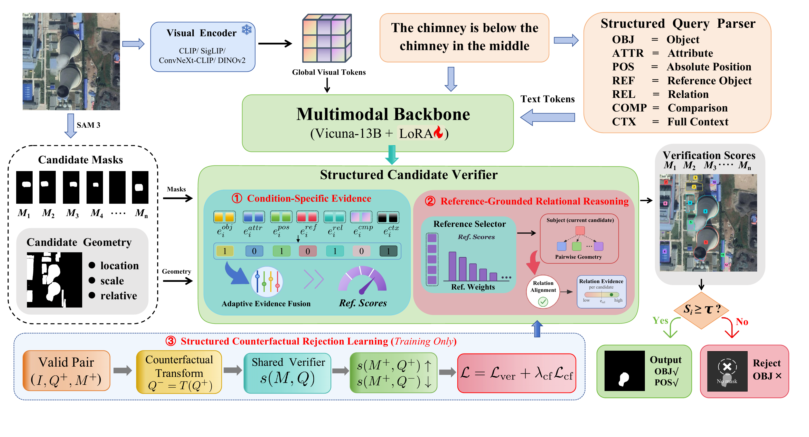
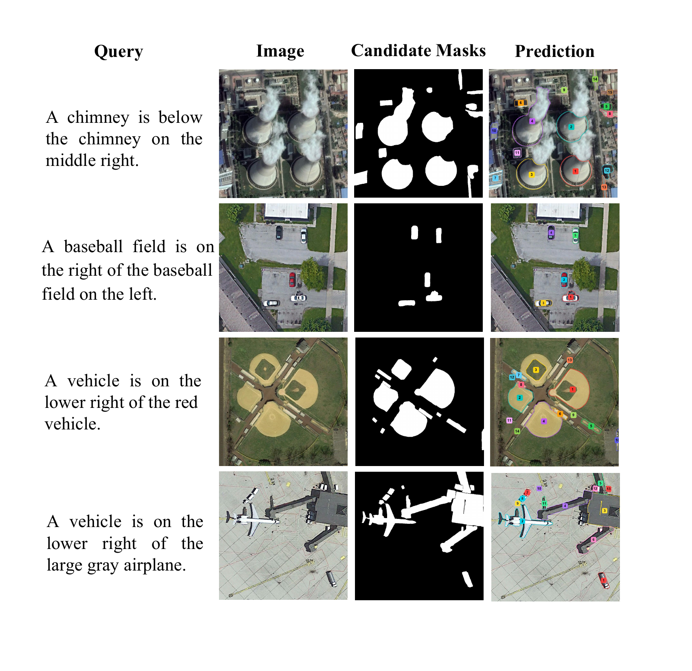

# SCV-RS

## Structured Candidate Verification for Reliable Referring Remote Sensing Image Segmentation

> This repository provides a lightweight preview of selected
> SCV-RS components and benchmark construction utilities. The complete
> implementation, model checkpoints, and reliability benchmark construction code
> will be released after the review process.

SCV-RS verifies candidate masks against a structured referring expression. It
decomposes the query into object, attribute, position, reference, relation,
comparison, and context evidence, then accepts the best supported candidate or
returns `[REJ]` when no candidate satisfies the query.

<p align="center">
  
</p>

## Core components

- **Structured query parsing** for target, attribute, position, reference,
  relation, comparison, and full-context conditions.
- **Structured candidate verifier** with condition-specific branches,
  reference selection, pairwise mask geometry, and gated evidence fusion.
- **Reliable rejection learning** with balanced candidate supervision,
  deterministic hard negatives, structured counterfactuals, and FP32-safe
  verifier execution.

## Qualitative examples

<p align="center">
  
</p>

## Installation

```bash
git clone https://github.com/LGChang1/SCV-RS.git
cd SCV-RS
pip install -e .
python -m nltk.downloader punkt punkt_tab \
  averaged_perceptron_tagger averaged_perceptron_tagger_eng
```

## Quick start

Parse a referring expression:

```bash
scvrs-parse "The small vehicle above the bridge"
```

Use the verifier with candidate features produced by a multimodal backbone:

```python
from scvrs.integration import run_verifier_fp32
from scvrs.model import ConditionVerifier

verifier = ConditionVerifier(candidate_dim=4096, hidden_dim=512).cuda()
output = run_verifier_fp32(
    verifier,
    candidate_states,
    mask_geometries,
    condition_embeddings,
    condition_present,
)
candidate_scores = [logits.sigmoid() for logits in output.logits]
```

## Structure

```text
src/scvrs/data/       query parsing, geometry, supervision, counterfactuals
src/scvrs/model/      structured candidate verifier
src/scvrs/            lightweight backbone-integration helpers
configs/              core verifier configuration
tests/                unit and numerical-stability tests
assets/               method and qualitative figures
```

## License

The code in this repository is released under the [MIT License](LICENSE).
